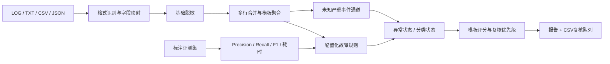

# AIOps 证据链故障诊断助手

一个本地运行、只读安全、证据优先的 AIOps 诊断 PoC。它从日志或故障描述中提取异常事件，进行基础敏感信息脱敏，形成风险判断、待验证根因、验证动作和 Markdown 诊断报告。

## 能力边界

### 本地 PoC 已实现

- 粘贴日志，读取 LOG、TXT、CSV、JSON 和 JSONL
- 中英文常见字段映射与多行异常合并
- 配置驱动的九类故障规则
- 开放集异常判断：区分“是否异常”和“能否分类”
- 未命中规则的FATAL、CRITICAL、SEVERE、ERROR进入“未知严重事件”通道
- 否定表达、恢复状态识别和重复事件聚合
- 稳定模板ID、模板频次、跨对象集中度和可解释异常评分
- 将批量日志压缩成高/中/低优先级人工复核队列，并支持CSV导出
- IPv4/IPv6、邮箱、手机号、令牌、Cookie、连接串和私钥等基础脱敏
- 风险判断、Top-3 类别假设、证据缺口与条件化修复建议
- Markdown 报告、本地审计记录、单元测试和可复现基准评测

### Codex Skill 可编排

- 借助当前运行环境读取 PDF、DOCX、XLSX 等运维材料
- 分析巡检报告、故障复盘和用户故障描述
- 按“事实—推断—待验证假设”生成完整诊断报告

### 尚未实现

- Prometheus、Grafana、ELK 等真实监控平台接入
- 指标、链路、变更记录和服务拓扑联合分析
- 自动工具调用、LLM 根因推理和自动修复
- 企业生产环境验证、身份权限和合规认证

## 快速启动

需要 Python 3.10 或更高版本，无第三方运行依赖。

```powershell
python3 scripts/server.py
```

浏览器访问 `http://127.0.0.1:8765`。

批处理企业导出日志：

```powershell
python3 scripts/triage_file.py incident.csv --output triage-output
```

输出Markdown报告、结构化JSON和可导入Excel/工单系统的CSV人工复核队列。试点方法见[企业日志初筛试点指南](docs/enterprise-pilot.md)。

## 测试与评测

```powershell
python3 -m unittest discover -s tests -v
python3 scripts/evaluate.py
```

评测集包含31个人工构造样例，其中5个同义表达挑战样例不参与规则设计。完整报告见 [evaluation/report.md](evaluation/report.md)。

| 指标 | 当前结果 |
|---|---:|
| 已知类别Precision | 1.000 |
| 已知类别Recall | 0.821 |
| 已知类别F1 | 0.902 |
| 开放集故障召回率 | 0.962 |
| 正常/恢复样例误报率 | 0.000 |
| Top-1 类别命中率 | 0.808 |
| 风险判断准确率 | 0.839 |

这些数字只描述当前人工样例集，不代表企业生产准确率。挑战集暴露了5类未覆盖同义表达，后续将通过独立公开数据和故障注入继续验证。

## 真实公开日志任务

项目已在Loghub官方BGL 2K样本上完成一次领域外评测。该样本包含2,000行Blue Gene/L超算日志，其中143行带官方告警标签。

- [完整任务报告](real_tasks/bgl_2k/report.md)
- [项目生成的诊断报告](real_tasks/bgl_2k/diagnosis.md)
- V1仅已知规则：Precision 0.182、Recall 0.042、F1 0.068
- V2加入未知严重事件：Recall 1.000、F1 0.537
- V3加入模板中高优先级：Precision 0.415、Recall 0.874、F1 0.563、FPR 0.095
- 2,000行日志被聚合为120个复核模板簇，工作量压缩94%
- 结论：项目已能承担只读日志初筛和人工复核分流，但不能替代根因确认

复现方式：

```powershell
python3 scripts/fetch_bgl_sample.py
python3 scripts/evaluate_bgl_task.py
```

外部数据不会提交到本仓库；下载脚本会校验SHA-256。

## 安全边界

当前版本只生成诊断建议，不连接生产系统，不自动执行排查或修复命令。规则匹配只用于形成待验证假设，不能替代运维人员确认。基础脱敏用于降低本地分析时的信息暴露风险，不代表满足任何合规标准。

## 架构



## 项目结构

```text
assets/web/                 本地 Web 界面
scripts/diagnosis_engine.py 诊断、脱敏与报告引擎
scripts/server.py           本地 HTTP 服务
scripts/evaluate.py         标注评测脚本
scripts/evaluate_bgl_task.py 真实公开日志任务评测
scripts/triage_file.py       本地批量日志初筛命令
rules/                      可扩展故障规则
config/                     可解释评分与优先级阈值
datasets/                   标注样例与挑战集
evaluation/                 可复现指标与失败案例
real_tasks/                 真实任务报告与诊断结果
docs/                       企业试点与使用边界
tests/                      自动化测试
references/                 故障知识、报告模板与检查清单
SKILL.md                    Codex Skill 工作流
```

## 当前阶段

该项目处于可运行、可评测的日志初筛MVP阶段，可用于本地或隔离环境中的只读日志分流、重复事件压缩和人工复核排序。企业生产试点前仍需要用本企业历史数据校准阈值、补充正常模板基线、身份权限、持久化数据库、监控平台接入、部署与合规建设。
